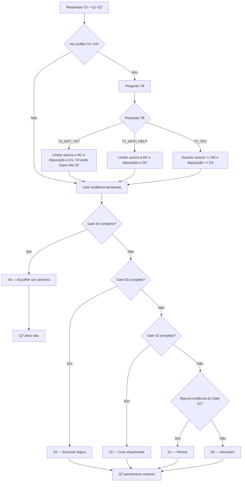

# ROTA ZERO ZERO — Auditoria lógica do diagnóstico V1

## Status

Mapa de auditoria do motor `R00-DIAG-1.0.0`.

Este documento não altera os gates. Ele registra como o motor se comporta quando todas as combinações possíveis de Q1–Q7 são exercitadas e destaca fronteiras que precisam de julgamento editorial antes de qualquer calibração.

---

## 1. O que está sendo auditado

A V1 possui:

- Q1 com 5 alternativas;
- Q2–Q6 com 4 alternativas cada;
- Q7 com 6 alternativas.

Isso gera:

```text
5 × 4 × 4 × 4 × 4 × 4 × 6 = 30.720 combinações base
```

Quando uma combinação dispara H1–H4, o motor exige TB. Na auditoria exaustiva, cada combinação conflitante é exercitada com as três respostas de desempate.

Snapshot atual:

| Medida | Quantidade |
|---|---:|
| Combinações base Q1–Q7 | 30.720 |
| Combinações que disparam conflito duro | 7.968 |
| Combinações sem conflito | 22.752 |
| Cenários classificados após expandir TB | 46.656 |

**Importante:** esses percentuais são do espaço combinatório uniforme, não uma estimativa de frequência em usuários reais. Uma combinação improvável no mundo real pesa tanto quanto uma combinação comum nesta auditoria.

---

## 2. Organograma do motor



---

## 3. Distribuição exaustiva atual

Considerando os 22.752 casos sem conflito uma vez e cada caso conflitante três vezes, uma por TB:

| Etapa | Cenários | % do espaço auditado |
|---|---:|---:|
| 00 — Descobrir | 288 | 0,62% |
| 01 — Pensar | 16.176 | 34,67% |
| 02 — Criar visualmente | 23.520 | 50,41% |
| 03 — Escrever lógica | 5.904 | 12,65% |
| 04 — Escolher um caminho | 768 | 1,65% |
| **Total** | **46.656** | **100%** |

Essa distribuição **não deve ser usada para afirmar que metade dos usuários reais será etapa 02**. Ela serve para detectar regiões excessivamente largas/estreitas do espaço lógico e mudanças inesperadas entre versões do algoritmo.

---

## 4. Conflitos duros no espaço combinatório

| Assinatura | Combinações base |
|---|---:|
| H1 | 1.536 |
| H2 | 1.536 |
| H1 + H2 | 1.536 |
| H4 | 2.976 |
| H3 | 288 |
| H3 + H4 | 96 |
| **Total** | **7.968** |

A taxa combinatória é 25,94%. Isso não prova que a pergunta de desempate aparecerá para 1 em cada 4 usuários. É apenas um sinal de que H1–H4 cobrem uma região relevante do espaço teórico e merecem especial atenção no teste com pessoas.

---

## 5. Auditoria de monotonicidade

Para cada pergunta ordinal Q1–Q6, a auditoria pega pares idênticos e aumenta apenas uma alternativa em um passo. Pares que entram ou saem de conflito são excluídos desta comparação porque deixam de ser equivalentes sem TB.

Resultado: **nenhuma regressão de etapa foi encontrada**.

| Pergunta alterada | Pares comparados | Regressões |
|---|---:|---:|
| Q1 — experiência | 16.608 | 0 |
| Q2 — clareza do projeto | 17.064 | 0 |
| Q3 — estrutura | 17.064 | 0 |
| Q4 — autoria/modificação | 16.608 | 0 |
| Q5 — depuração | 16.992 | 0 |
| Q6 — representação | 15.936 | 0 |

Isso sustenta uma propriedade importante: dentro das fronteiras não conflitantes, declarar uma evidência ordinalmente mais forte não faz a pessoa voltar para uma etapa anterior.

---

## 6. Fronteiras que exigem auditoria humana

### F1 — Q3 pode provocar salto 02 → 04

Existem **288 pares** em que subir Q3 apenas um nível produz salto de duas etapas.

Exemplo mínimo:

```text
Antes
Q1 E1_FOLLOWED
Q2 P0_NONE
Q3 S1_PARTS_HELP
Q4 M2_SMALL_INDEPENDENT
Q5 D3_HYPOTHESIS_SOURCE
Q6 R3_WRITE_TEXT
→ 02

Depois: apenas Q3 muda
Q3 S2_STEPS_RULES
→ 04
```

Pergunta de auditoria:

> Passar de “separa algumas partes com ajuda” para “descreve passos, regras ou decisões principais” deve, quando todas as demais evidências já são fortes, permitir atravessar diretamente de 02 para 04?

Pode ser coerente com gates cumulativos; também pode indicar que a escala de Q3 carrega poder classificatório maior do que a linguagem da alternativa faz parecer.

### F2 — Q4 pode provocar salto 02 → 04

Existem **288 pares** em que subir Q4 apenas um nível produz salto de duas etapas.

Exemplo mínimo:

```text
Antes
Q1 E1_FOLLOWED
Q2 P0_NONE
Q3 S2_STEPS_RULES
Q4 M1_SMALL_HELP
Q5 D3_HYPOTHESIS_SOURCE
Q6 R3_WRITE_TEXT
→ 02

Depois: apenas Q4 muda
Q4 M2_SMALL_INDEPENDENT
→ 04
```

Pergunta de auditoria:

> A diferença entre “pequena mudança com alguma ajuda” e “pequena mudança sozinho e testa o efeito” está redigida com nitidez suficiente para justificar que, em perfis fortes nas demais dimensões, ela seja a evidência que libera o 04?

Esse é um ponto prioritário para teste semântico com usuários.

### F3 — T0 e T1 são equivalentes para a etapa

Nos **7.968 conflitos**, `T0_NOT_YET` e `T1_WITH_HELP` nunca produzem etapas diferentes na V1.

A diferença entre eles afeta a evidência normalizada e pode alterar `reasonCodes`, mas não a classificação 00–04.

Isso ocorre porque ambos limitam Q4 efetivo a no máximo `M1_SMALL_HELP`; sem autoria M2/M3, Gate 03 e Gate 04 não podem ser satisfeitos. A diferença D1 versus D2 em Q5 não atravessa sozinha outro gate.

Pergunta de auditoria:

> Queremos que “ainda não” e “sim, com alguma ajuda” tenham o mesmo ponto de partida e apenas uma explicação diferente, ou o desempate deveria realmente separar etapas em algum subconjunto de casos?

**Não alterar agora.** Primeiro validar se essa equivalência faz sentido editorialmente.

---

## 7. Invariantes protegidos pela bateria

A auditoria automatizada falha se ocorrer qualquer um destes eventos:

1. mesmas respostas produzem resultados diferentes;
2. `SELF` e `OTHER` mudam etapa ou rota;
3. Q7 altera `stage`;
4. etapa 00–03 ativa uma rota;
5. etapa 04 deixa de ativar rota;
6. `I_UNSURE` em 04 deixa de retornar `open_exploration`;
7. um conflito duro é classificado sem TB;
8. aumentar uma alternativa ordinal reduz etapa em um par não conflitante.

Os saltos maiores que uma etapa são **registrados**, mas não falham automaticamente. Eles exigem julgamento humano, porque podem ser consequência legítima de gates cumulativos.

---

## 8. Como reproduzir

```bash
node diagnostico/diagnostic-exhaustive-audit.js
node diagnostico/diagnostic-audit-tests.js
```

Para gerar artefatos de inspeção sem versionar milhares de linhas no repositório:

```bash
node diagnostico/diagnostic-exhaustive-audit.js \
  --json=/tmp/r00-audit-summary.json \
  --csv=/tmp/r00-audit-all.csv
```

O CSV contém cada cenário classificável com Q1–Q7, TB, conflitos, etapa, rota, confiança e reason codes.

---

## 9. Decisão desta fase

A V1 **não será recalibrada apenas porque a auditoria encontrou uma fronteira sensível**.

Ordem correta:

```text
coerência lógica
→ revisão semântica das perguntas
→ testes com pessoas
→ comparação do resultado percebido
→ só então eventual alteração dos gates
```

Qualquer alteração de regra deve gerar nova versão do algoritmo e atualização deliberada dos snapshots de regressão.
